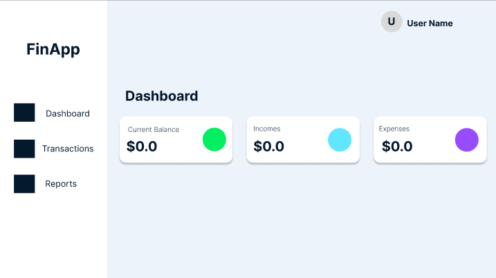

# MoneyWise

MoneyWise is your comprehensive **financial companion**, designed to streamline your financial management effortlessly. With MoneyWise, you can seamlessly track your budgets, maintain your financial balance, and stay updated on stock market trends. Our app presents your financial data in an engaging and user-friendly manner, ensuring you always have a clear grasp of your financial health.

<a href="https://moneywise-fin-app-cfc615d6c6e8.herokuapp.com/accounts/login/">Demo</a>

This was a group projects created by 4 developers in 5 days. The following was the members of the team and their main contributions and the links to individual githubs:

- [**Ryan Bulluss (Myself)**](https://github.com/RyanBulluss): Managed the repository, Backend of the application (routing, middleware, authentcation, models, etc.) and some front end setting up the data flow to display in charts.

- [**Callum Hui**](https://github.com/Callumwhhui): The frontend using CSS and Bootstrap in tandem with JavaScript to craft a user experience that is both functional and aesthetically pleasing.

- [**Agathe Lav**](https://github.com/AgatheLouiseLav): The frontend using CSS and Bootstrap in tandem with JavaScript to craft a user experience that is both functional and aesthetically pleasing. She also creted the functionality for the dark theme and navbar toggle.

- [**Kai Cope**](https://github.com/Viver2nd): Kept a balance between the front-end and back-end to ensure seamless data flow and provide support to front-end team members as required.

Our journey began with meticulous planning – from designing the [ERD](https://lucid.app/lucidchart/9985c499-91e7-458b-b83d-1e5883719283/edit?invitationId=inv_3caa7902-431a-45ff-8d95-b6348f94f7a1&referringApp=slack&page=0_0#) and [Wireframe](https://www.figma.com/file/fuBNpy4XGEFMZMEx97aOBA/FinanceApp?type=design&node-id=0-1&mode=design) to streamlining tasks through our [Trello](https://id.atlassian.com/login/authorize?application=trello&continue=https%3A%2F%2Ftrello.com%2Fauth%2Fatlassian%2Fcallback%3FreturnUrl%3D%252Fb%252FumsLnd9q%252Ffinanceappproject3%26display%3D%26aaOnboarding%3D%26updateEmail%3D%26traceId%3D%26ssoVerified%3D%26createMember%3D&token=eyJraWQiOiJtaWNyb3Mvc2lnbi1pbi1zZXJ2aWNlL2E1amFwZ2RwOWh0cnM3MTIiLCJhbGciOiJSUzI1NiJ9.eyJtYXJrZWRWZXJpZmllZCI6ImZhbHNlIiwibG9naW5UeXBlIjoic2Vzc2lvblJlZnJlc2giLCJpc3MiOiJtaWNyb3Mvc2lnbi1pbi1zZXJ2aWNlIiwidXNlcklkIjoiNzEyMDIwOmRlZTI2MDY0LTIyZDItNGFhZi1iZWRiLTI0NjI5MzMwYjU4NyIsImlzU2xhY2tBcHBTb3VyY2UiOiJmYWxzZSIsImF1ZCI6Imxpbmstc2lnbmF0dXJlLXZhbGlkYXRvciIsIm5iZiI6MTY5MTY1OTUwNiwic2NvcGUiOiJMb2dpbiIsImV4cCI6MTY5MTY1OTYyNiwiaWF0IjoxNjkxNjU5NTA2LCJqdGkiOiJlNGVhYjcyMS0yYWM2LTQ1N2UtYWNkYy1kZWU3YTQxZDcyZjUiLCJoYXNoZWRDc3JmVG9rZW4iOiI4OTllYWRjMWU3MWM3MzBlZGY0YTg3MjMwZjM1OWI0ZmNjYTNjNDA4ODExYWU1M2ZmMjNhZGIzZDU5NmFiMmU3In0.v3tF2sY6oe4yebbFb_Tp8BQAu5vyR2JvDg974C65Doo9CL42wl0xkjhRimxmYMd0rYOQe4Fb_1ljYM8sfbSylCshCf4zHoSZN_JpyIVm5RgXTHNcH3uj8YGZOkiVRj6QzzUGR97h2BLYUI6quDXPsF4xLr3teicQMgwDDztsNr4161TFs79aOcaNCMogDiat9ykjgZw0DG-pAILww2Lj50fpZ37bVA6dsJJOMShC-aSotUHhR1CpYZQau-6ZOrKfm55GKjmYhcyHGOXOYb2l7k18zqJDJ9p5ZqUtHwbi14F6X-uCIOXSsPWVRRT3NoxFpWR6Bj-auaqtz_MUe1JfEg) board.

## Planning:

Above is the wireframe created by Agathe. we took a lot of inspiration for the user interface from an existing app in the market called [Mobills](https://www.mobillsapp.com/). As none of us are experienced in graphic design, this gave us a great stepping stone into creating an app that had the professional feel of an industry tier financial hub.

With that planned out, we were free to plan the functionality:

We started with a basic plan, using a diagram with parts like users, accounts, incomes, and expenses. We used Django and PostgreSQL for the technical work. After that, we made it even better by adding features like budgeting that help users manage their money.

## Technologies Used:

- HTML,
- CSS,
- Bootstrap,
- Unicons,
- JavaScript,
- Charts.js,
- Python,
- Django,
- PostgreSQL,
- NeonDB,
- Git,
- GitHub,
- Alpha vantage stock API.

## My Wins

I found the Django framework to be a real pleasure in this project. It provided a solid structure for setting up routes, authentication, models, and basic CRUD operations, making the development process remarkably straightforward. Thanks to Django's simplicity, we quickly powered through the MVP phase and were able to create an app that we could genuinely take pride in.

APIs weren't the primary focus of the project, but I managed to integrate the Alpha Vantage stocks API. This enabled users to access stock market information, which we presented using ChartJS to provide clear and user-friendly visuals of stock trends.

Throughout the week, I significantly enhanced my grasp of GitHub repositories and the process of merging code with fellow developers. Initially, dealing with merge conflicts was quite daunting, as I was concerned about unintentionally introducing bugs into the main repository. However, as the week progressed, I started developing an instinct for handling merging challenges. This project marked my first experience collaborating with other developers, offering valuable lessons in teamwork, leadership, and group organization within a coding environment.

## My Struggles

During development, we encountered an issue with the stocks API. The problem arose because I initially overlooked the fact that full access to the API was restricted behind a paywall. Consequently, if users performed more than 100 stock searches in a day, their access would be limited. Given our time constraints for the project, I decided to implement a message to inform users when the API failed, helping them understand why it wasn't working as expected. In an ideal scenario with more time, I would explore the possibility of using a different API service to avoid these limitations.

We encountered another issue related to merging because we initially didn't set up a .gitignore file at the beginning of the project. This led to problems when trying to push files like dotenv files to the repository. Fortunately, we addressed this issue fairly swiftly, and for the remainder of the week, merging didn't pose much of a problem.

## Key Learnings

**More thorough planning**: While our Trello board, ERD, and wireframes served as valuable tools, we recognize that more detailed planning and task prioritization could have enhanced our coordination with fellow team members.

**Consistent styling**: We encountered challenges in the project with some team members preferring vanilla CSS while others opted for Bootstrap, resulting in confusing and inconsistent code for app styling. Moving forward, it would be beneficial to have discussions about styling guidelines to ensure that everyone's code is easily readable and understandable by other team members.

## IceBox
- Change stock API
- Improve responsiveness for mobile
- Integrated bank accounts (Plaid API)